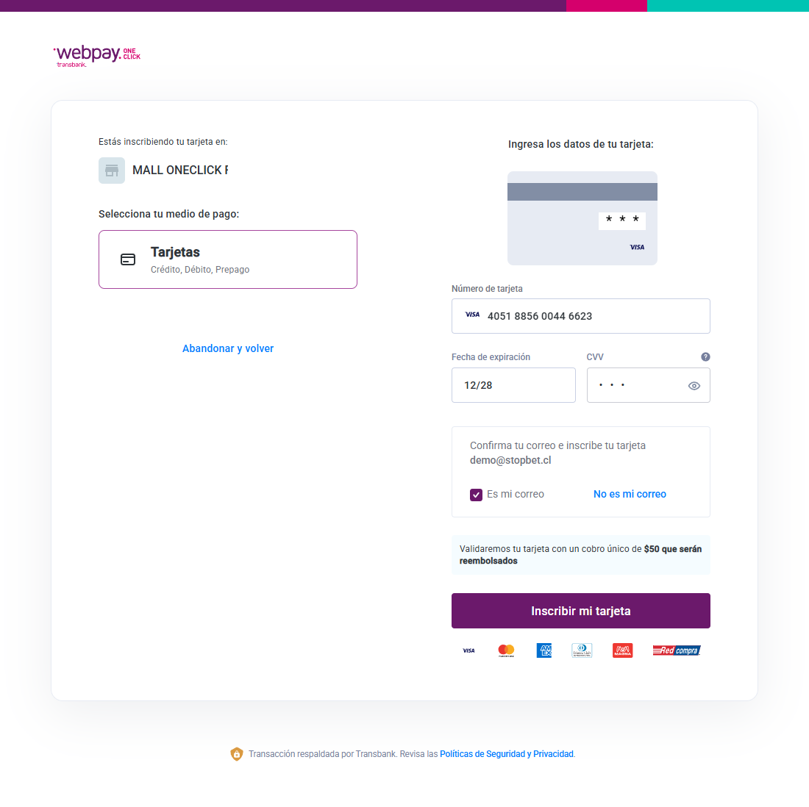
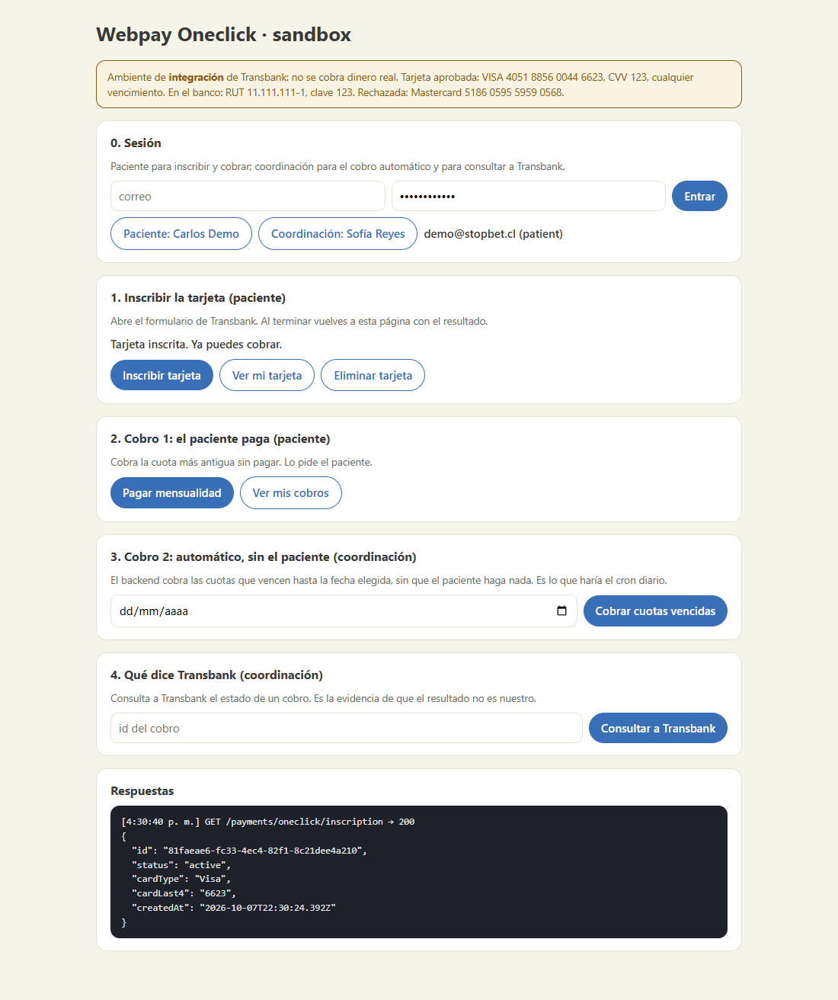
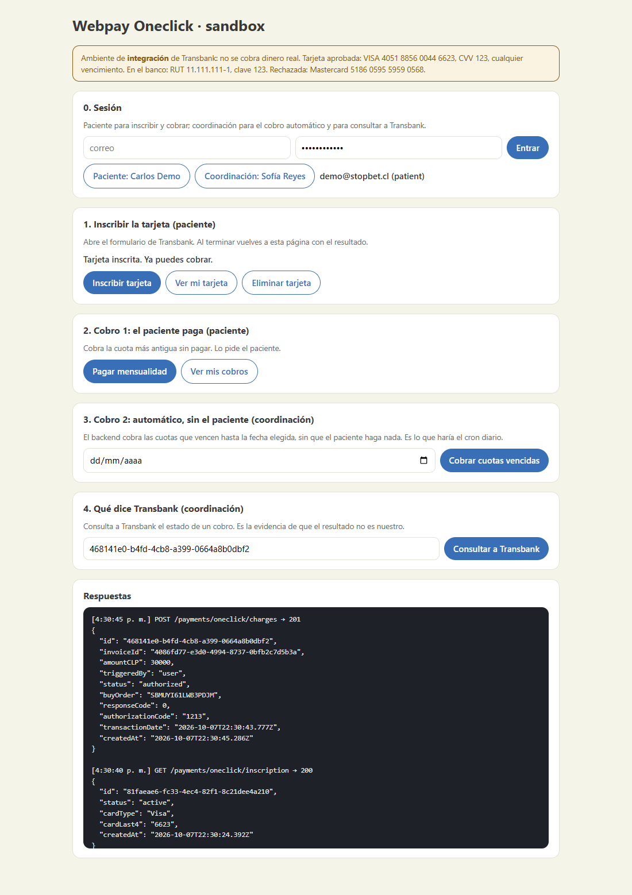
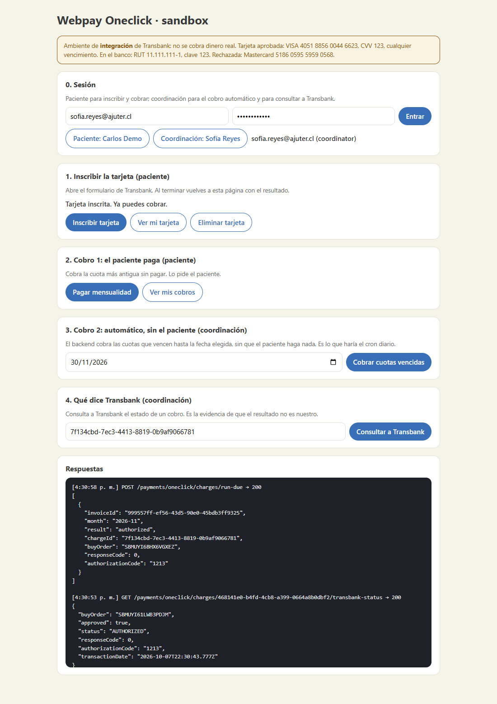

# SPIKE 2 (CA5-CA6) — Pasarela de pago para la mensualidad de AJUTER

**Dueño:** Matías Lara (ejecutado por José Meza) · **Rama:** `feature/spike-2-pasarela-pago`
**Historias que dependen de esto:** HdU09 y HdU12 (pago de la mensualidad), HdU19 (activación de la cuenta tras aprobar la solicitud), HdU23 (el familiar paga las cuotas del paciente)
**Criterios:** CA5 y CA6 del SPIKE 2 (`docs/Sprint 2.md`).

> **Estado (07-10-2026):** CA5 y CA6 **cubiertos**. La comparación (§2 y §3) tiene fuentes del mismo
> día. El PoC (§4) corre contra el ambiente de **integración** de Transbank y su evidencia está en §5:
> una tarjeta inscrita y **dos cobros AUTHORIZED**, el segundo disparado por el backend sin el
> paciente. Lo marcado _verificado_ tiene fuente en §3; lo marcado _inferencia_ o _no verificado_
> **no se afirma todavía**. Lo que falta para producción está en §7.

**Respuesta corta:** la pasarela recomendada es **Transbank Webpay Oneclick (Mall)**. Es la única de
las tres que une una comisión más baja, un SDK oficial para Node, un sandbox con credenciales
públicas (sin crear cuenta) y un cobro posterior que el **propio backend** dispara sin que el
paciente haga nada. Su costo es de trámite, no técnico: AJUTER tiene que afiliarse a Transbank y
pasar su validación, y **nada de eso se puede acelerar desde el código** (§7, riesgo principal).
**Flow** queda como respaldo; **Mercado Pago** no encaja con un cobro a demanda.

---

## 1. Qué necesita StopBet de una pasarela

La mensualidad es de **$30.000 CLP** (`MONTHLY_AMOUNT_CLP`, `apps/backend/src/billing/billing.service.ts`).
Hoy `POST /billing/pay` **marca la cuota como pagada sin cobrar nada** (`docs/ASUNCIONES-PENDIENTES.md`,
punto 6). Lo que le pedimos a la pasarela real:

| Necesidad | Por qué |
|---|---|
| **Enrolar la tarjeta una sola vez** | El paciente no debería teclear su tarjeta cada mes: la HdU09 y la regla del cliente de suspender al tercer mes impago suponen un cobro que ocurre solo |
| **Cobrar después desde el backend, sin el paciente** | Es el CA6: «el segundo [cobro], sin interacción del usuario» |
| **StopBet nunca ve la tarjeta** | Datos de pago de personas en tratamiento por ludopatía: lo mínimo posible en nuestra base. La tarjeta se ingresa en un formulario de la pasarela |
| **Confirmación que el backend pueda verificar** | Una cuota solo se marca pagada con la respuesta de la pasarela, nunca con lo que diga el navegador |
| **Sandbox usable en el plazo** | El Spike se cierra dentro del sprint |

---

## 2. Comparación (CA5)

### 2.0 Matriz

| | **Transbank Oneclick Mall** | **Flow** (Cargo Automático / Suscripciones) | **Mercado Pago** (Suscripciones) |
|---|---|---|---|
| **Comisión crédito** | **2,29 % + IVA** [T1] | 2,89 % + IVA (abono al 3.er día hábil) o 3,19 % + IVA (día hábil siguiente) [F1] | 2,89 % + IVA (a 10 días) o 3,19 % + IVA (al instante) [M1] |
| **Débito y prepago** | **1,49 % + IVA** [T1]. Que Oneclick los admita: ver §2.1 | Mismo % que crédito [F1]. Cargo Automático «en tarjetas de crédito, débito y prepago» [F3]; la especificación de la API solo dice crédito [F4] | Mismo % [M1]. «Tarjeta de crédito o débito» [M3] |
| **Costos fijos o de instalación** | Ninguno publicado [T5] [T6] | «Sin costos fijos ni de mantención» [F1] | «No hay costos fijos» [M2] |
| **Abono** | 24 a 72 h; en Oneclick, débito 24 h y crédito 48 h hábiles [T1] [T5] | 3.er día hábil o día siguiente [F1] | Al instante o a 10 días, **a la cuenta Mercado Pago** [M1] |
| **Devolución** | Reversa (monto total, dentro de 3 h) o anulación (hasta 90 días por API) [T8]. El costo solo aparece en un PDF de 2023 [T9] | $202 + IVA por reembolso; el pagador debe aceptarlo en 10 días [F1] [F2] | Hasta 180 días, requiere saldo [M7]. Costo: no verificado |
| **Quién agenda el cobro** | **Nuestro backend** (un cron) | Flow (planes) **o** nuestro backend (`customer/charge`) [F3] | Mercado Pago [M4] |
| **Cobro sin el usuario, por API** | **Sí:** `authorize` con el `tbk_user` guardado [T3] | **Sí:** `customer/charge` [F4] | **No a demanda.** Se modifica la suscripción. «Pagos Automáticos» exige autorización comercial y no se confirmó en Chile [M9] |
| **Reintentos** | Los maneja el comercio | `charges_retries_number` en planes (3 por omisión) [F4] | Hasta 4 en 10 días; tras 3 cuotas rechazadas se da de baja [M4] |
| **Límites** | Se fijan en la afiliación (códigos -97, -98, -99) [T3] [T4] | $250.000 por pago, $500.000 diarios, 5 pagos diarios por cliente; ampliables [F3] | No encontrados |
| **SDK para Node** | `transbank-sdk` 6.1.1, **oficial** [T15] | **No hay oficial**: REST con firma HMAC-SHA256 [F4] | `mercadopago` 3.6.1, **oficial** [M11] |
| **Cómo llega la confirmación** | Redirección del navegador + una llamada del backend. **Sin webhook, sin URL pública de servidor a servidor** | Llamada de Flow a nuestra URL (POST con token) y consulta; **URL pública** | Webhooks; **URL pública** [M8] |
| **Sandbox** | **Credenciales públicas, sin cuenta** [T7] | Cuenta aparte en sandbox.flow.cl [F5] | Cuentas y usuarios de prueba [M6] |

**Costo de un cobro de $30.000** (cálculo propio con las tasas de arriba; la comisión no incluye IVA):

| Opción | Comisión neta | Con IVA 19 % |
|---|---|---|
| Transbank, crédito (2,29 %) | $687 | $818 |
| Transbank, débito o prepago (1,49 %) | $447 | $532 |
| Flow o Mercado Pago (2,89 %) | $867 | $1.032 |
| Flow o Mercado Pago (3,19 %) | $957 | $1.139 |

Con 100 pacientes pagando con crédito, Transbank cuesta ≈ **$81.800 al mes** y Flow o Mercado Pago a
2,89 %, ≈ **$103.200**: unos $21.000 mensuales de diferencia, que crecen con el número de pacientes.

> ⚠️ **Corrección al presupuesto.** `docs/presupuesto-stack-2026-09.md` (§3.4) usa 2,35 % y 1,75 %.
> La página oficial de tarifas hoy dice **2,29 % y 1,49 %** «a partir del 1 de septiembre de 2026
> para nuevos comercios afiliados» [T1]. Las cifras del presupuesto siguen publicadas en el centro de
> ayuda de Transbank [T2], pero sin fecha. Se actualizó el presupuesto. Ambas valen **para comercios
> nuevos**: si AJUTER ya fuera cliente de Transbank, hay que confirmar cuál le toca.

### 2.1 Transbank Webpay Oneclick Mall — la recomendada

**Verificado:**
- **Enrolamiento:** el backend llama a `inscriptions` (`username`, `email`, `response_url`) y recibe un token y una URL. El navegador del paciente se envía por **POST con `TBK_TOKEN`** al formulario de Transbank. Ahí el paciente ingresa la tarjeta y se autentica con su banco. El formulario dura **4 minutos** en producción [T3].
- **Al volver** al `response_url`, el backend debe llamar a `finish` **dentro de 60 segundos** o Transbank borra la inscripción. `finish` entrega el `tbk_user` y los datos de la tarjeta (tipo y últimos 4 dígitos). Un mismo `username` solo puede tener una tarjeta [T3].
- **Cobro sin el paciente:** `authorize` con `username`, `tbk_user`, una orden de compra y el detalle. Responde en el mismo llamado, por cada tienda. «Oneclick solo opera en modalidad Mall»: un código de comercio mall y uno o más códigos de tienda [T3]. **Aprobado = `response_code` 0 y `status` `AUTHORIZED` en cada detalle** [T4].
- **Límites** de monto por pago, monto diario y cantidad diaria: se definen en el contrato de afiliación [T3] [T4].
- **Sandbox con credenciales públicas** (mall `597055555541`, tiendas `597055555542` y `597055555543`) y tarjetas de prueba documentadas [T7]. La URL de retorno puede ser `localhost`: es una redirección del navegador, no una llamada de Transbank a nuestro servidor.
- **Alta de comercio:** formulario en publico.transbank.cl, firma digital y código de comercio por correo. La validación de integraciones Oneclick Mall con SDK es **un formulario online**; al aprobarla entregan la llave secreta de producción y piden una **compra real de $50** [T7].
- **Requisitos:** una persona jurídica debe tener inicio de actividades en el SII [T10]. La documentación que listan (escritura o extracto de constitución con vigencia, cédula del representante legal) corresponde a solicitudes posteriores a la afiliación y se trata como indicativa [T11].
- **SDK:** `transbank-sdk` 6.1.1 (publicada el 09-12-2025, BSD-3, Node ≥ 18, depende de `axios`). **Todos sus métodos devuelven `Promise<any>`**: la regla del repo de no usar `any` obliga a tipar las respuestas en un adaptador [T15].

**Débito y prepago: las fuentes se contradicen.** La documentación técnica dice que la autorización valida «tarjeta de crédito, débito o prepago» y la respuesta lista los tipos `VD` y `VP` [T3] [T4]. La frase «no se aceptan tarjetas de débito ni prepago» está en la sección de **captura diferida**, no en la descripción general [T3]. El centro de ayuda afirma que desde 2020 Oneclick admite todos los medios, pero en otros párrafos habla solo de crédito [T6]. _Lo más probable es que sí admita débito, pero hay que pedírselo por escrito al ejecutivo antes de comprometerse._

**Inferencias:**
- Sin webhook, el flujo en la app móvil queda como: abrir en el navegador la página de Transbank, volver a un endpoint HTTPS **del backend** que llama a `finish` y de ahí redirigir a la app.
- Los cobros posteriores no se autentican con el banco. Ante un contracargo, el riesgo probablemente recae en el comercio [T9]. Sin confirmar.
- La ayuda dice que para usar Oneclick «es necesario que el comercio ya posea Webpay Plus» [T6]; la página pública dice que un cliente existente puede contratarlo [T5]. **Preguntar si Oneclick se contrata solo.**

### 2.2 Flow — el respaldo

**Verificado:**
- **Cargo Automático** es lo más parecido a Oneclick: se enrola la tarjeta una vez en una página de Flow (`customer/register`) y después el backend cobra con `customer/charge`, con la respuesta en el mismo llamado [F4]. Además ofrece **suscripciones** donde es Flow quien agenda (planes con reintentos) [F3] [F4].
- **Pero** el comercio necesita **una cuenta corriente bancaria a nombre de una empresa con RUT en el SII**, que el giro del SII ampare lo que cobra, y que el servicio esté publicado en una página web pública con precio y condiciones. «Si eres persona natural, por el momento este servicio solo se encuentra disponible para empresas» [F3].
- Acepta contribuyentes afectos, exentos «o que reciben donaciones» [F5].
- La API es REST con firma HMAC-SHA256 [F4]. **No existe cliente oficial para Node**: el repositorio oficial es de PHP y no se toca desde 2019. Hay paquetes de terceros, pero conviene un cliente propio de ~100 líneas antes que depender de un paquete no oficial con un solo mantenedor _(opinión)_.
- El sandbox exige crear una cuenta en dashboard.sandbox.flow.cl [F5]. Para pagos recurrentes la documentación solo trae tarjetas de prueba **de Perú** [F6].

**No verificado:** si una **fundación** cuenta como «empresa» para Cargo Automático, los documentos exactos y el plazo de revisión (las páginas de creación de cuenta devolvieron 403), y si el débito enrola de verdad (la FAQ dice que sí; la especificación de la API dice solo crédito).

### 2.3 Mercado Pago — no encaja con un cobro a demanda

**Verificado:**
- Las **suscripciones** (`/preapproval`) las agenda Mercado Pago: «programa y crea automáticamente los pagos». **El comercio no dispara un cobro ad hoc**; se modifica la suscripción [M4] [M5].
- Reintentos: hasta 4 en 10 días; **tras 3 cuotas rechazadas, la suscripción se da de baja** [M4]. Eso pisa la regla del cliente (suspender al tercer mes impago): sería Mercado Pago quien decide.
- «Pagos Automáticos» (cobro iniciado por el comercio, sin CVV) existe en la documentación, pero «es necesario contar con la autorización del equipo Comercial», y **no pude confirmar que aplique a Chile** [M9].
- Las notificaciones de las suscripciones exigen una **URL pública** [M8]. El abono llega a una cuenta Mercado Pago, no directamente al banco [M1].
- SDK oficial `mercadopago` 3.6.1, con tipos incluidos [M11].

**No verificado:** requisitos de una cuenta de empresa para una fundación, plazos y costo de reembolso (las páginas exigen sesión o cargan por JavaScript).

### 2.4 Descartes

| Opción | Por qué se descarta |
|---|---|
| **Webpay Plus** | Cada pago exige al titular en el formulario de Transbank [T3]. **No cumple el CA6** |
| **PatPass by Webpay** | Solo tarjetas de crédito, y la documentación dice que los cobros se administran en Transdata (un archivo BIC), no por API [T13] [T14] |
| **Khipu, pago instantáneo** | Transferencia que exige al usuario cada vez |
| **Khipu, Pagos Automáticos** | Existe, por mandato y transferencia, «desde 0,0125 UF + IVA» por transacción (≈ $612 con IVA). Pero requiere activación comercial y no verifiqué bancos, límites ni plazos [K1] [K2]. **Vale una consulta como alternativa**, no se evaluó a fondo |

---

## 3. Fuentes

Todas consultadas el **07-10-2026**. Las cifras de tarifas cambian: antes de contratar, repetir la consulta.

**Transbank**
- [T1] https://publico.transbank.cl/tarifas · [T2] https://ayuda.transbank.cl/tarifas-vender-webpay
- [T3] https://www.transbankdevelopers.cl/documentacion/oneclick · [T4] https://www.transbankdevelopers.cl/referencia/oneclick
- [T5] https://publico.transbank.cl/productos-y-servicios/soluciones-para-ventas-internet/webpay-oneclick · [T6] https://ayuda.transbank.cl/que-es-webpay-oneclick
- [T7] https://www.transbankdevelopers.cl/documentacion/como_empezar · [T8] https://www.transbankdevelopers.cl/producto/webpay
- [T9] PDF «Servicios y Tarifas a Establecimientos de Comercios» (~2023): https://publico.transbank.cl/documents/20129/0/Servicios+y+Tarifas+a+Establecimientos+de+Comercios.pdf/fd4a881b-602e-68a6-e681-b7fcb61391dc
- [T10] https://ayuda.transbank.cl/como-vender-transbank · [T11] https://ayuda.transbank.cl/requerimientos
- [T13] https://publico.transbank.cl/productos-y-servicios/soluciones-para-ventas-internet/webpay-patpass · [T14] https://www.transbankdevelopers.cl/documentacion/patpass
- [T15] `npm view transbank-sdk` (6.1.1)

**Flow**
- [F1] https://web.flow.cl/tarifas/ · [F2] https://web.flow.cl/es-cl/reembolsos/ · [F3] https://web.flow.cl/es-cl/preguntas-frecuentes/cargo-automatico/
- [F4] https://www.flow.cl/docs/apiFlow.yaml · [F5] https://web.flow.cl/es-cl/ayuda/ · [F6] https://developers.flow.cl/docs/credentials

**Mercado Pago**
- [M1] https://www.mercadopago.cl/herramientas-para-vender/suscripciones · [M2] https://www.mercadopago.cl/herramientas-para-vender/link-de-pago
- [M3] https://www.mercadopago.cl/developers/es/docs/subscriptions/overview · [M4] .../subscriptions/integration-configuration/subscription-no-associated-plan/authorized-payments
- [M5] .../subscriptions/integration-configuration/subscription-associated-plan · [M6] .../subscriptions/additional-content/your-integrations/test/cards
- [M7] .../subscriptions/additional-content/cancellations-and-refunds · [M8] .../subscriptions/additional-content/your-integrations/notifications/webhooks
- [M9] https://www.mercadopago.cl/developers/es/docs/automatic-payments/overview.md · [M11] `npm view mercadopago` (3.6.1)

**Khipu:** [K1] https://www.khipu.com/en-us/page/tarifas-pagos-automaticos · [K2] https://docs.khipu.com/en/payment-solutions/automatic-payments/description

**No se pudieron leer** (exigen sesión, cargan por JavaScript o dieron 403): https://www.mercadopago.cl/costs-section/, la ayuda de comisiones de Mercado Pago, las páginas de creación de cuenta de Flow y las de alta de empresa de Mercado Pago. Lo que dependía de ellas está marcado _no verificado_.

---

## 4. El PoC del CA6

Módulo `apps/backend/src/payments/`. **No toca ninguna pantalla de pacientes ni de familiares**: se
usa desde una página de prueba que sirve el propio backend.

### 4.1 Flujo

```
Paciente (sesión)          Backend (StopBet)                     Transbank (integración)
      │  POST /inscriptions ─────▶│  start(userId, email, URL de retorno) ─▶│
      │◀── { token, urlWebpay } ──│◀──────────────── token + url_webpay ─────│
      │  el navegador hace POST con TBK_TOKEN a urlWebpay ─────────────────▶│  formulario + banco
      │◀──────────── vuelve por GET/POST a /inscriptions/return?TBK_TOKEN ───│
      │                           │  finish(token) ──────────────────────────▶│  (dentro de 60 s)
      │                           │◀── tbk_user + tipo y últimos 4 dígitos ───│  se guarda cifrado
      │◀── 303 a la página con el resultado

COBRO 1 (lo pide el paciente)      POST /charges ──▶ authorize(tbk_user, buyOrder, monto) ──▶ AUTHORIZED
COBRO 2 (sin el paciente)          run-due / cron ──▶ authorize(...) con la misma tarjeta ───▶ AUTHORIZED
```

**StopBet nunca ve la tarjeta:** el formulario es de Transbank. Lo único que se guarda es el `tbk_user`
(un identificador que solo sirve con nuestro código de comercio, **cifrado en reposo** con la misma
columna que el RUT), el tipo de tarjeta y los **últimos 4 dígitos**.

### 4.2 Piezas

| Pieza | Qué hace |
|---|---|
| `oneclick.gateway.ts` | **Único** archivo que importa `transbank-sdk` (6.1.1, versión fija). El SDK devuelve `any`; acá cada respuesta se lee como `unknown` y se valida. Cambiar a Flow es tocar este archivo. Sin configuración de producción se apaga y los endpoints responden 503. |
| `payment_inscriptions` | La tarjeta del paciente. Índice único parcial: **una sola activa por usuario**. Estados: `pending`, `active`, `failed`, `aborted`, `deleted`. |
| `payment_charges` | Cada intento de cobro, con la orden de compra padre e hija (únicas, ≤26 caracteres), monto, `triggeredBy` (`user` o `automatic`), estado y el código y la hora que devuelve Transbank. |
| `oneclick-payments.service.ts` | Inscripción, cobro de una cuota, cobro de las vencidas y el cron. Liquida la cuota con `BillingService.settleInvoices`, la misma ruta que usa el pago simulado, así que reactiva la cuenta y crea la cuota siguiente igual que hoy. |
| `tbk-return-params.decorator.ts` | Lee **solo** `TBK_TOKEN`, `TBK_ORDEN_COMPRA` y `TBK_ID_SESION` del retorno de Transbank. Con un DTO, el `ValidationPipe` global (`forbidNonWhitelisted`) respondería 400 al navegador ante cualquier campo extra. |
| `oneclick-test-page.ts` | La página de prueba (`/payments/oneclick/test-page`), con los botones de cada paso y la respuesta JSON a la vista. |

### 4.3 Endpoints

| Endpoint | Acceso | Para qué |
|---|---|---|
| `POST /payments/oneclick/inscriptions` | paciente | Inscribir la tarjeta |
| `GET` y `POST /payments/oneclick/inscriptions/return` | público, 20 por minuto | A donde vuelve Transbank; siempre redirige 303 al resultado |
| `GET` y `DELETE /payments/oneclick/inscription` | paciente | Ver o eliminar la tarjeta |
| `POST /payments/oneclick/charges` | paciente | **Cobro 1** |
| `GET /payments/oneclick/charges` | paciente | Sus cobros |
| `POST /payments/oneclick/charges/run-due` | coordinación, solo con `ENABLE_DEV_TOOLS` | **Cobro 2**, sin el paciente |
| `GET /payments/oneclick/charges/:id/transbank-status` | coordinación, solo con `ENABLE_DEV_TOOLS` | Qué dice Transbank de un cobro |
| `GET /payments/oneclick/test-page` | público, solo con `ENABLE_DEV_TOOLS` | Página de prueba |

### 4.4 Que no se cobre dos veces

El riesgo real de un cobro automático es cobrar dos veces la misma cuota. Tres defensas:
1. La fila de `payment_charges` se inserta en `processing` **antes** de llamar a Transbank, y un
   **índice único parcial** sobre `invoiceId` (estados `processing` y `authorized`) hace que el segundo
   intento falle en la base, no en el código. Un cobro rechazado no bloquea el reintento.
2. El SDK envuelve todos los errores de `axios` en el mismo tipo. Un **4xx** significa «Transbank dijo que
   no, no se cobró»; **cualquier otro fallo** (timeout, red) es indeterminado, y entonces se consulta
   `status(ordenPadre)`. Si tampoco responde, el cobro **queda en `processing`** y bloquea la cuota: es
   preferible una cuota trabada que revisa una persona a un cobro doble.
3. Aprobado quiere decir `response_code === 0` **y** `status === 'AUTHORIZED'` en **cada** detalle. El
   ejemplo del SDK mira un `status` de nivel superior que la respuesta no trae.

### 4.5 Configuración

Todo opcional. Sin ninguna variable usa el ambiente de integración con las credenciales públicas de
Transbank (no se cobra dinero real).

| Variable | Para qué |
|---|---|
| `TBK_ENVIRONMENT` | `integration` (por defecto) o `production`. En `production` sin los tres datos de abajo, **se apaga**: no cae a las credenciales de prueba. |
| `TBK_ONECLICK_COMMERCE_CODE`, `TBK_ONECLICK_CHILD_COMMERCE_CODE`, `TBK_API_KEY` | Los datos de comercio que entrega Transbank al afiliar a AJUTER. |
| `BACKEND_PUBLIC_URL`, `TBK_RESULT_URL` | A dónde vuelve el navegador tras Transbank (URL pública del backend, y opcionalmente otra página de resultado). |
| `TBK_AUTO_CHARGE_CRON` | `true` activa el cobro automático diario a las 09:00 de Chile. **Apagado por defecto**, para no cobrar sobre la base de demo de Railway. |
| `ENABLE_DEV_TOOLS` | Habilita la página de prueba, el cobro por fecha y la consulta de estado. |

Los logs llevan ids, orden de compra, estado y código. **Nunca** correo, `tbk_user`, `TBK_TOKEN` ni datos de tarjeta.

### 4.6 Tests

- **Unitarios** (`payments/*.spec.ts`, `billing/billing.service.spec.ts`): inscripción ok, rechazada, anulada, repetida y con timeout; cobro autorizado que liquida la cuota; rechazado que no la toca; error de red que consulta el estado; sin doble cobro; el mapeo de las respuestas del SDK.
- **e2e** (`test/payments.e2e-spec.ts`, 27 casos): Transbank reemplazado por un gateway falso, así que corre en CI. Usa el `ValidationPipe` real de `main.ts`. Cubre permisos, el retorno por GET con parámetros desconocidos y por POST urlencoded, la anulación, **los dos cobros** (paciente y automático), el 409 de la doble cobranza, el rechazo y el 404 de las herramientas de desarrollo.

## 5. Evidencia del sandbox

Corrida del **07-10-2026 (19:30, hora de Chile)** contra `webpay3gint.transbank.cl` (ambiente de
integración, credenciales públicas), con el backend local y los datos del seed. Paciente: Carlos Demo.
Coordinación: Sofía Reyes. El recorrido lo hizo un script de Playwright sobre el **formulario real** de
Transbank, no una simulación.

### 5.1 Inscripción de la tarjeta

VISA de prueba `4051 8856 0044 6623`, banco de prueba (RUT `11.111.111-1`, clave `123`).



Resultado en StopBet: tarjeta `Visa` terminada en `6623`, estado `active`, código de respuesta `0`. El
`tbk_user` queda cifrado en la columna (no se muestra en ninguna respuesta de la API).



### 5.2 Los dos cobros

| | Cobro 1 | Cobro 2 |
|---|---|---|
| Quién lo dispara | el paciente (`POST /charges`) | el backend, **sin sesión del paciente** (`run-due` como coordinación) |
| `triggeredBy` | `user` | `automatic` |
| Cuota | 2026-10 · $30.000 | 2026-11 · $30.000 |
| Orden de compra | `SBMUYI61LWB3PDJM` | `SBMUYI6BHX6VGXEZ` |
| Resultado | `AUTHORIZED`, código `0`, autorización `1213` | `AUTHORIZED`, código `0`, autorización `1213` |
| Hora que informa Transbank | 19:30:43 (Chile) | 19:30:56 (Chile) |
| Estado de la cuota después | `paid` | `paid` |





**Confirmación de Transbank, no nuestra.** `GET /charges/:id/transbank-status` le pregunta a Transbank por
la orden de compra de cada cobro:

```json
{ "buyOrder": "SBMUYI61LWB3PDJM", "approved": true, "status": "AUTHORIZED", "responseCode": 0,
  "authorizationCode": "1213", "transactionDate": "2026-10-07T22:30:43.777Z" }
{ "buyOrder": "SBMUYI6BHX6VGXEZ", "approved": true, "status": "AUTHORIZED", "responseCode": 0,
  "authorizationCode": "1213", "transactionDate": "2026-10-07T22:30:56.616Z" }
```

**En la base** (`payment_charges` unido con `invoices`):

```
 parentBuyOrder   | amountCLP | status     | trigger   | rc | auth | tipo | month   | factura
 SBMUYI61LWB3PDJM |     30000 | authorized | user      |  0 | 1213 | VN   | 2026-10 | paid
 SBMUYI6BHX6VGXEZ |     30000 | authorized | automatic |  0 | 1213 | VN   | 2026-11 | paid
```

El paciente recibió dos avisos «Recibimos tu pago» (2026-10 y 2026-11) con `target: payment`.

### 5.3 Casos negativos

| Caso | Qué se hizo | Resultado |
|---|---|---|
| Tarjeta rechazada | Mastercard de prueba `5186 0595 5959 0568` | Transbank la rechaza al inscribir (código `-1`). Inscripción `failed`, el paciente sigue sin tarjeta. |
| El paciente abandona | «Abandonar y volver» en el formulario de Transbank | Llega `TBK_ORDEN_COMPRA`: no se llama a `finish`. Inscripción `aborted`. |
| Eliminar la tarjeta | `DELETE /inscription` | Se borra en Transbank y en StopBet; sirve para repetir la demo. |
| Doble cobro | Cobrar otra vez la cuota ya pagada; correr `run-due` dos veces | 409 y no se llama a Transbank; la segunda corrida no cobra nada. (Probado en el e2e.) |

---

## 6. Pasos para cubrir mis CA

### Paso 1 — CA5: comparación de pasarelas ✅ listo
Secciones 2 y 3. Tres pasarelas comparadas (Oneclick, Flow, Mercado Pago) en costo, cobro recurrente,
requisitos de comercio e integración con NestJS, con los descartes justificados.

### Paso 2 — CA6: construir el sandbox ✅ listo
Módulo `payments` del backend con Webpay Oneclick Mall (§4), con tests unitarios y e2e.

### Paso 3 — CA6: correr el sandbox y juntar la evidencia ✅ listo
Una inscripción de tarjeta y **dos cobros**, el segundo disparado por el backend sin el paciente, ambos confirmados por Transbank (§5).

### Paso 4 — Cierre ✅ listo
Actualizados `docs/ASUNCIONES-PENDIENTES.md`, `docs/presupuesto-stack-2026-09.md`, `docs/avisos-al-equipo.md`, `docs/security/permissions-matrix.md` y `CLAUDE.md`.

---

## 7. Alcance para producción

**Fuera de este Spike** (el sandbox no toca las pantallas de pacientes ni de familiares):
- **Cambiar el pago simulado por el real** en `PaymentScreen`, `SuspendedAccountScreen` y el portal del familiar.
- **Quién paga**, el paciente o el familiar (`ASUNCIONES-PENDIENTES.md`, punto 4). Inscribir la tarjeta de un familiar no está resuelto.
- **Paciente suspendido:** hoy no puede ni iniciar sesión para pagar (punto 5). Un cobro automático lo reactiva **sin que él entre**, lo que resuelve parte del problema. Falta decidir si eso es lo que quiere el cliente.
- **La regla del tercer mes** (punto 5-bis) y los **reintentos** ante un rechazo: ninguna pasarela decide eso por nosotros con Oneclick.
- **Devoluciones**, y **qué dice la notificación** al paciente cuando un cobro falla.
- **Atar la activación de la cuenta** (HdU19) al primer cobro exitoso.

**Riesgo principal: la afiliación de AJUTER a Transbank.** Es un trámite comercial con firma de contrato,
validación y una compra real de $50, y **ninguna cifra pública dice cuánto demora** (el único «24 a 72
horas» que encontré es de otro producto, el Link de Pago [T16]). Hay que pedir los datos por escrito
**ya**, porque ni la integración ni el sandbox lo adelantan:
1. ¿La tarifa de Oneclick es la misma 2,29 % / 1,49 %?
2. ¿Oneclick admite débito y prepago?
3. ¿Se contrata sin tener Webpay Plus? ¿Qué límites de monto diario y por pago se pueden fijar para $30.000?
4. ¿Qué documentos pide a una **fundación**, y cuánto demora?
5. IVA: si los ingresos de AJUTER son exentos o no afectos, el IVA de la comisión es un costo no recuperable _(inferencia tributaria: consultar al contador)_.

Si la respuesta de Transbank es mala o lenta, **el respaldo es Flow**, que exige una cuenta corriente de
empresa y tiene una comisión más alta. La integración está aislada detrás de un adaptador (§4) justo
para que cambiar de pasarela no toque el resto del backend.

### Lo que apareció al probar contra el sandbox real

Cosas que la documentación de Transbank no avisa y que conviene tener a mano al pasar a producción:
- **La hora viene en hora de Chile con sufijo `Z`**, no en UTC: leída tal cual, el cobro quedaba 3 horas
  antes. Se corrige en `chileWallClockToDate` (con test para el cambio de hora). **Hay que volver a
  verificarlo con el código de comercio de producción**, porque es un comportamiento observado, no documentado.
- **No hay cómo forzar un rechazo en `authorize`** con las tarjetas de integración: la Mastercard se rechaza
  ya al inscribir. El rechazo de un cobro se probó solo con tests (unitario y e2e), no contra Transbank.
- **El `finish` de una inscripción que nunca se completó responde `-96`**, y Transbank documenta que hay que
  llamarlo dentro de 60 s. Se trata como inscripción fallida, sin error para el navegador.
- **Las inscripciones abandonadas quedan `pending`** para siempre (en la prueba quedaron 4). No molestan, pero
  hace falta una tarea que las venza antes de producción.
- **Un cobro que queda en `processing`** (red cortada y Transbank sin responder el estado) bloquea su cuota a
  propósito. Falta una tarea de conciliación que lo resuelva consultando a Transbank.
- **La primera inscripción de una tarjeta real cobra $50 y los devuelve** (según la documentación de Transbank): hay que decírselo al paciente en la pantalla.
- Detalle del formulario de integración: la fecha de vencimiento hay que teclearla como `1228` (`12/30` no la
  acepta) y el botón de inscribir sigue deshabilitado hasta marcar «Es mi correo».
